<style>
  footer {
    text-align: left;
    font-size: .30em;
  }
</style>

# Scaling from Zero to Hero
Cloudflare Workers as your only backend

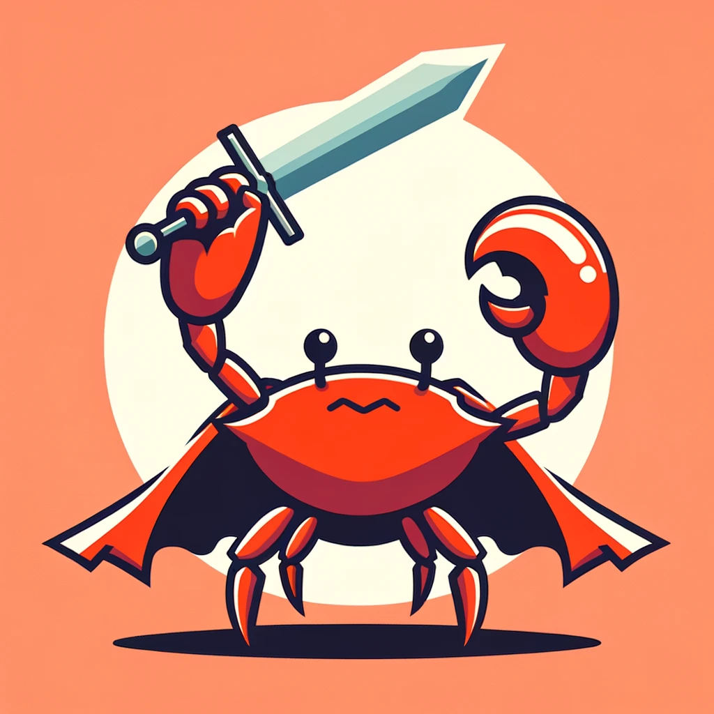

---
# Motivation


<style scoped>
  p {
    font-size: 0.7em;
  }
</style>


> Prompt: Friends gathered around a table happily playing board games. Around them is a large crowd of people upset that they can't join in.

<!-- ChatGPT Platonic form of a boardgame --->

----

# Avalon
Up to 10 players

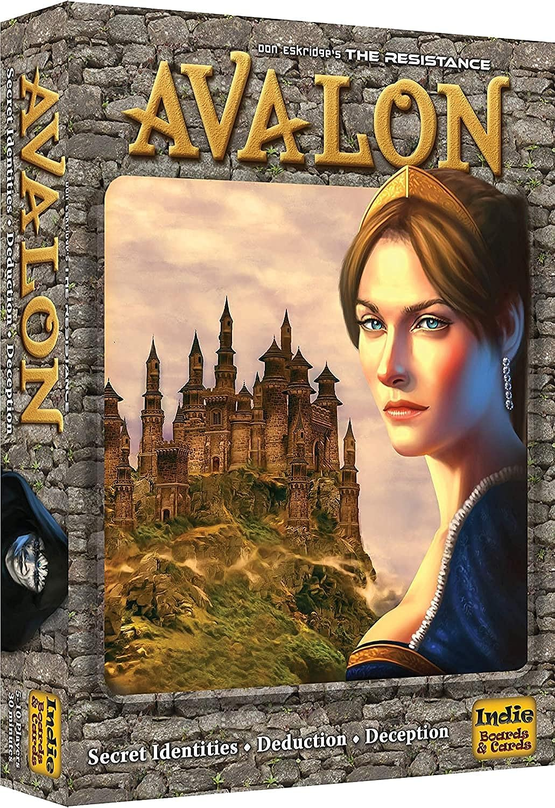

--- 

# Secret Hitler
Up to 10 players


--- 

# Codenames
4+ players

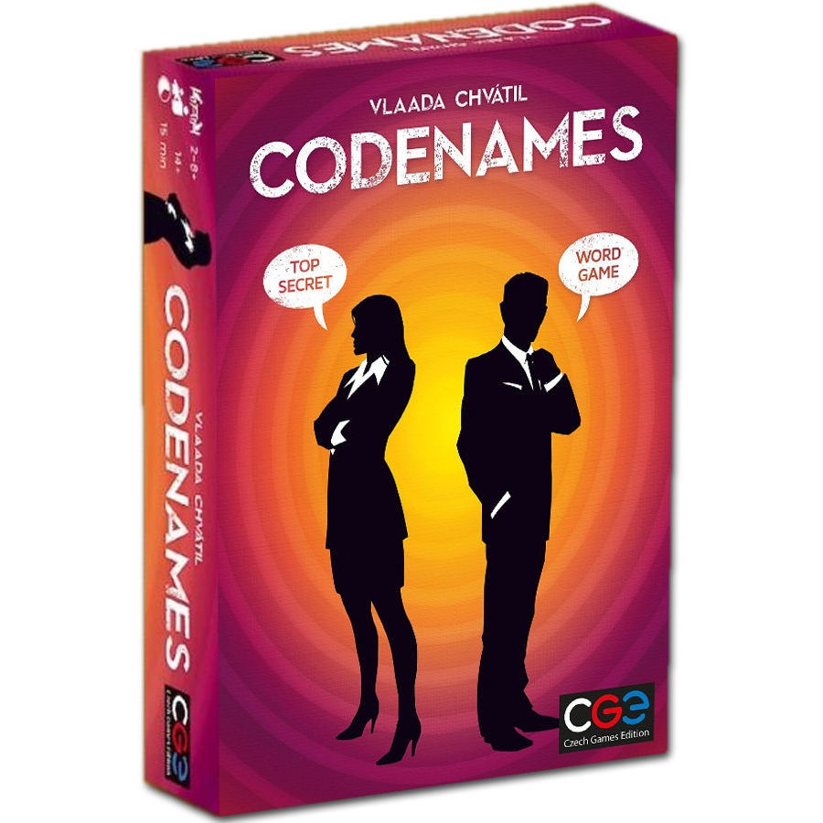

--- 

# The secret?
Simultaneous turns

---

# Inspiration
Quibble Race

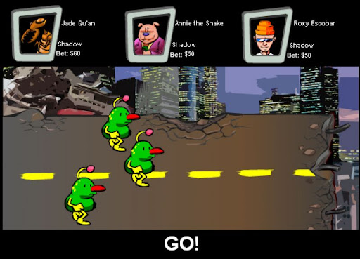

---

# Inspiration
Quibble Race

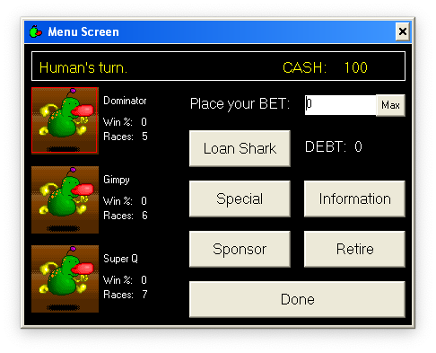

---

# Playtest

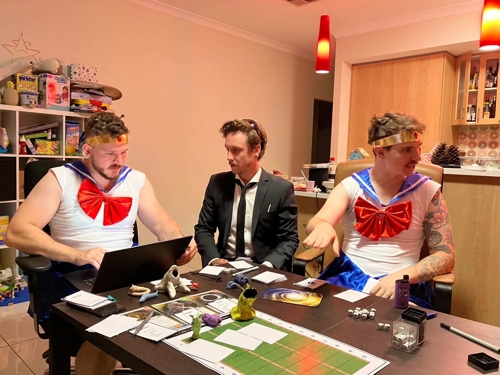


---

<style scoped>
  footer {
    display: none;
  }
</style>

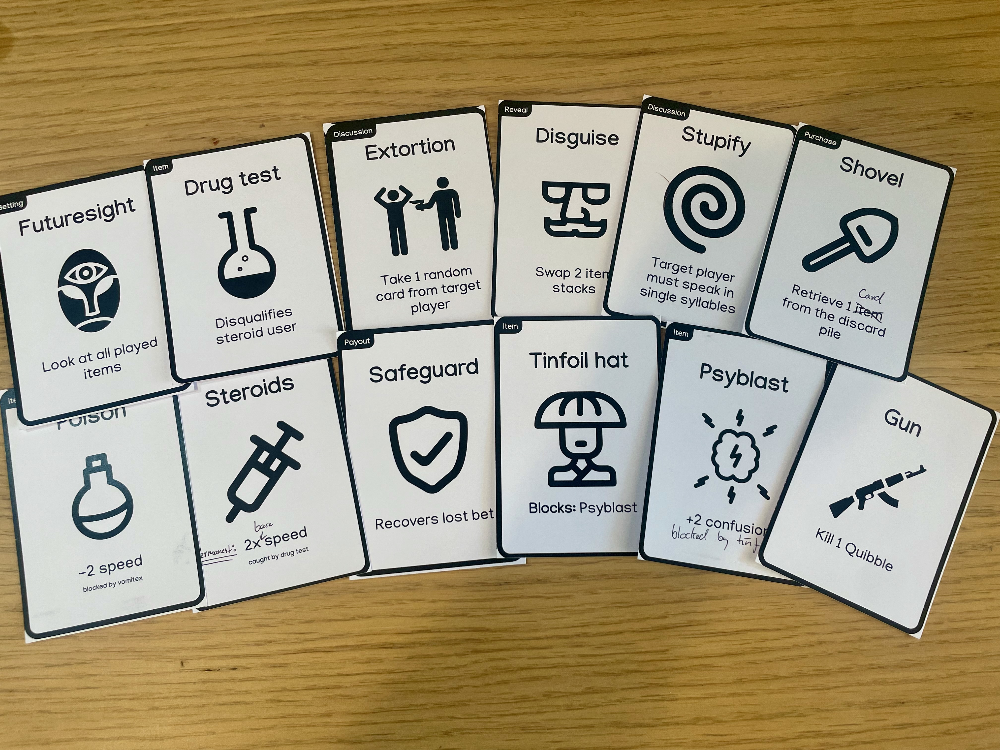

---

<style scoped>
  footer {
    display: none;
  }
</style>


---

# Inspiration
Jack Box

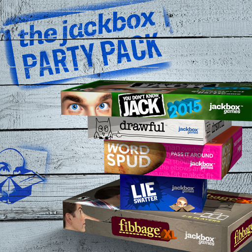

---

# The crux
Realtime multi-client state synchronisation

---

# Constraints
- Cost
- Latency
- Realtime
- Web Technologies

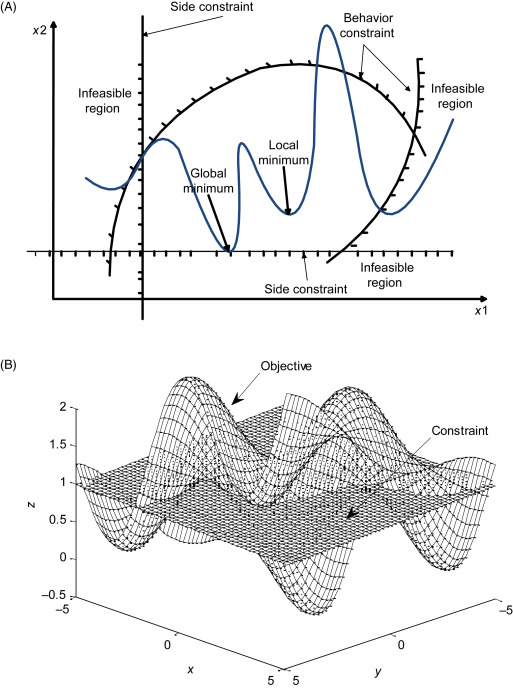

<!-- Downloading an app is a non-starter -->

---

# Cost vs Load

Technology | Low | Medium | High
-- | -- | -- | --
Peer to Peer | Free | Free | Free
Dedicated | Low | Medium | High
Serverless | Free | Low | Very High

---

# Peer to Peer (WebRTC)
*The not so golden goose*
- LAN only or deal with NATs / Firewalls
- STUN (Session Traversal Utilities for NAT) 
- TURN (Traversal Using Relays around NAT)
- Impossible to diagnose customer problems

---

# Latency
- Peer to Peer
  - LAN is ideal
  - Round trip to TURN
- Round trip to server
- Cost of multi-region

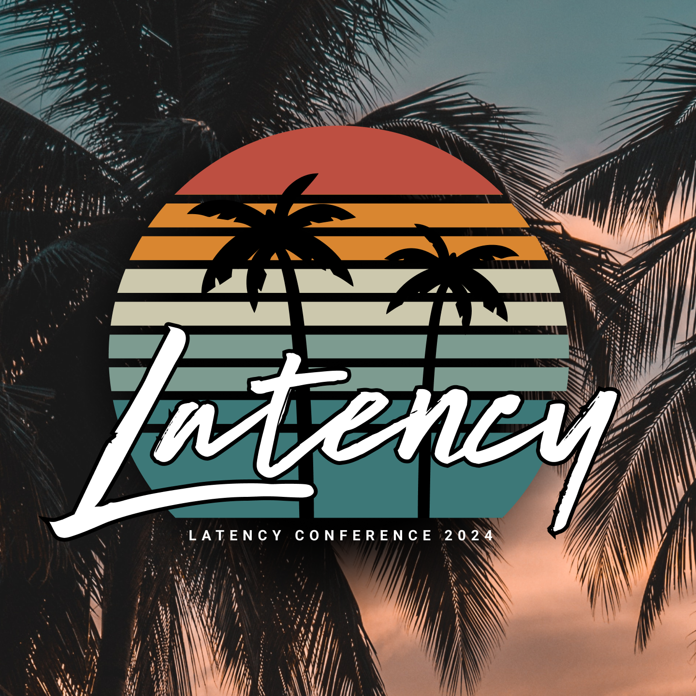

---

# Realtime
- Long Polling
- SSE (Server Side Events)
- WebSockets

<!-- TCP vs UDP synchronisation -->
<!-- Edge mitigates some of the downsides of TCP -->

---

# Persistent Connections + Serverless = \$\$\$


---

# Costing Example
- 15 Players (+1 host)
- 100 User Messages / game
- 1hr Game
- Minimum Resource Consumption (RAM, CPU, etc)

---

<style scoped>
  li {
    font-size: 0.6em
  }
</style>

## AWS Lambda
US East

- Free - 1e6 req, 111 GBhr
- Paid - \$0.2/1e6 req, \$0.054/GBhr
- 15 Minute Lambda Timeout


---

## AWS Lambda
US East

- Free - 60 / month
- Paid - $100 / kGame


---

<style scoped>
  li {
    font-size: 0.6em
  }
</style>

## API Gateway
US East

- Message defined as 32Kb Chunks
- Expensive Fanout
- Free tier is only first year
- Free Tier - 1e6 msgs, 12.5e3 hrs
- $0.25/16.6e3 hrs, $1/1e6 msgs


---

## API Gateway
US East

- 625 free games
- \$1.84 / kGames
- DynamoDB charges


---

<style scoped>
  footer {
    display: none;
  }

  h1 {
    color: black;
    margin-top: 0.5em;
  }

  section {
    justify-content: start;
  }
</style>

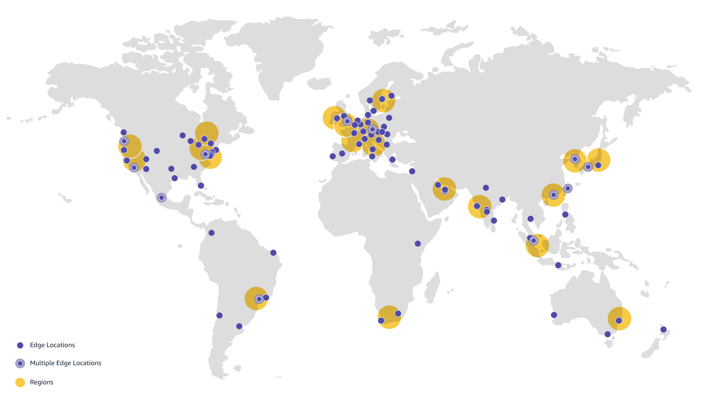

# AWS Region Locations

---

<style scoped>
  footer {
    display: none;
  }

  h1 {
    color: black;
    margin-top: 0.5em;
  }

  section {
    justify-content: start;
  }
</style>

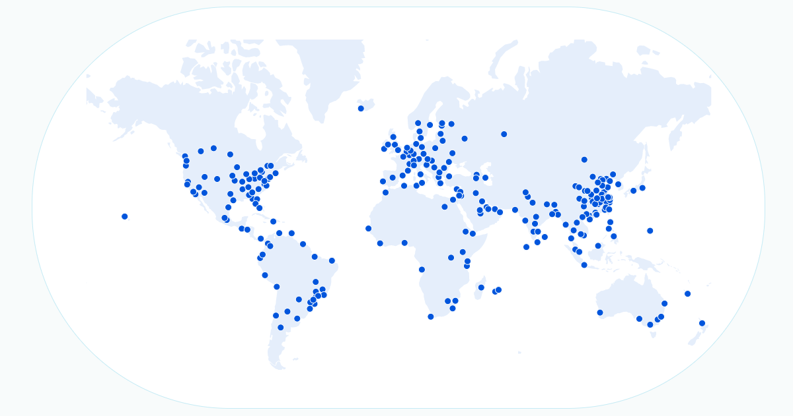

# Cloudflare Edge Network

---


## Cloudflare Edge Workers

- Pricing: Clock vs Wall Time
- JS / WASM Only
- V8 Isolates not Containers / VMs
- 0ms Cold Starts

<!-- QR Code links to talk from Cloudflare -->
<!-- Needed 100x efficiency gain over containers -->
<!-- Supports alarms to wake back up to perform a task -->

---

## Cloudflare Edge Workers

| Tier | Requests | CPU Time |
| --- | --- | --- |
| Free | 1e5/day | 10ms/req |  
| Paid | 1e7/mth |  3e7ms/mth |
| Extended | 30c / 1e6req | 2c / 1e6ms |   

---

# Need more info
# What about state?

---


# Cloudflare Edge State
- D1: SQLite Compatible
- KV: Key Value Store
- Durable Objects: ???

---


# D1
- SQLite Compatible
- Single Writer
- Limited Read Replicas
- Transactions through JS stored procedures

<!-- CockroachDB serverless instead -->

---


# KV
- Key Value Store
- Eventually Consistent
- Globally Replicated
- Low Latency

---

<style scoped>
  li {
    font-size: 0.9em
  }
</style>

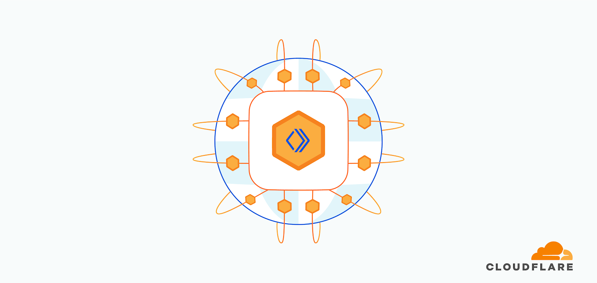

## Durable Objects

- Global Singleton JS Objects
- Ephemeral in memory state
- Durable Transactional KV

<!-- DDD Language: Aggregate Root / Transactional Context -->
<!-- Separate game and user DO for shared rate limiting -->
<!-- Unit of sharding -->

---
### Basic Worker

Typescript

```ts
export default {
  async fetch(request: Request, env: Env, ctx: Context): Promise<Response> {

    return new Response("Hello, World");
  
  }
}
```
---

### Basic Worker

Rust

```rust
#[wasm_bindgen]
pub async fn fetch(req: Request, env: Env, ctx: Context) -> Result<Response> {

  Response::ok("Hello, World")

}
```

---

### Using a Durable Object

Typescript

```ts
export default {
  async fetch(request: Request, env: Env, ctx: Context): Promise<Response> {
    const id = env.NAMESPACE.idFromName("OBJECT_NAME");

    return env.NAMESPACE.get(id).fetch(request);
  }
}
```

---

### Using a Durable Object

Rust

```rust
#[wasm_bindgen]
pub async fn fetch(req: Request, env: Env, ctx: Context) -> Result<Response> {

  ctx.durable_object("NAMESPACE")
     .id_from_name("OBJECT_NAME")
     .get_stub()?
     .fetch_with_request(req)
     .await

}
```

---

Real World Example

```rs
.on_async(
    "/api/object/game/by_code/:code/*command",
    |req, ctx| async move {
        let object_name = ctx
            .param("code")
            .ok_or("failed to find game code parameter in route")?
            .to_uppercase();

        ctx.durable_object("GAME")?
            .id_from_name(&object_name)?
            .get_stub()?
            .fetch_with_request(req)
            .await
    },
)
```

---

### Receiving Requests on a Durable Object

Typescript

```ts
export class Counter {
  async fetch(request: Request) {
    return new Response("Hello, World");
  }
}
```

---

### Receiving Requests on a Durable Object

Configuration File `wrangler.toml`

```toml
name = "example"

[[durable_objects.bindings]]
name = "COUNTER"
class_name = "Counter"

[[migrations]]
tag = "v1"
new_classes = ["Counter"]
```


---
Rust

```rs
#[durable_object]
pub struct Counter;

#[durable_object]
impl DurableObject for Counter {
    pub fn new(state: State, env: Env) -> Self {
        Counter {}
    }

    pub fn fetch(&mut self, req: Request) -> Result<Response> {
       Response::ok("Hello, World")
    }
}
```

---
Ephemeral Object State
Typescript

```ts
export class Counter {
  private count: number;

  constructor(_state: DurableObjectState, _env: Env) {
    this.count = 0;
  }

  async fetch(request: Request) {
    this.count += 1;

    return new Response(`Hello, World ${count}`);
  }
}
```

---

```rs
#[durable_object]
pub struct Counter {
  pub count: i32;
};

#[durable_object]
impl DurableObject for Counter {
    pub fn new(state: State, env: Env) -> Self {
        Counter { count: 0 }
    }

    pub fn fetch(&mut self, req: Request) -> Result<Response> {
      self.count += 1;

      Response::ok(format!("Hello, World {}", self.count))
    }
}
```

---

```rs
#[wasm_bindgen]
pub struct Counter {
  pub count: i32;
};

impl Counter {
    #[wasm_bindgen(constructor)]
    pub fn new(state: State, env: Env) -> Self {
        Counter { count: 0 }
    }

    #[wasm_bindgen]
    pub fn fetch(&mut self, req: Request) -> Result<Response> {
      self.count += 1;

      Response::ok(format!("Hello, World {}", self.count))
    }
}
```

---
```ts
export class Counter {
  private state: DurableObjectState;

  constructor(state: DurableObjectState, env: Env) {
    this.state = state;
  }

  async fetch(request: Request) {
    let count = await this.state.storage.get("count") ?? 0;
    count += 1;
    
    await this.state.storage.put("count", count);
    
    return new Response(`Hello, World ${count}`);
  }
}
```

<!-- Hidden data race handled by implicit transactions -->

---

```rs
#[durable_object]
pub struct Counter {
  pub state: State
};

#[durable_object]
impl DurableObject for Counter {
    pub fn new(state: State, env: Env) -> Self {
        Counter { state }
    }

    pub fn fetch(&mut self, req: Request) -> Result<Response> {
      let mut count: i32 = self.state.storage.get("count").await.unwrap_or(0);
      count += 1;

      self.state.storage.put("count", count).await?;

      Response::ok(format!("Hello, World {}", count))
    }
}
```

---

```rs
async fn hydrate(&mut self) -> Result<()> {
    if self.hydrated {
        return Ok(());
    }

    let events = self
        .storage
        .list_with_options(ListOptions::new().prefix("EVENT#"))
        .await?;

    events.for_each(&mut |value, key| {
        let event = serde_wasm_bindgen::from_value::<Event>(value)
            .expect("unable to deserialize value from storage during rehydration");
        
        self.events.push_back(event);
    });

    self.hydrated = true;

    Ok(())
}
```
---

Ok that's cool.

But what about the websocket problem?

---

# Hibernatable Web Sockets

- Free to hold the socket open indefinitely
- Free fanout
- Free heartbeats
- Supports tagging and other metadata

---

<style scoped>
  footer {
    display: none;
  }
</style>

Message Relay Server

```ts
export class Relay {
  constructor(
    private state: DurableObjectState
  ) {}

  async fetch(request: Request): Promise<Response> {
    const [client, server] = new WebSocketPair();

    this.state.acceptWebSocket(server);

    return new Response(null, { status: 101, webSocket: client });
  }

  async webSocketMessage(incoming: WebSocket, message: ArrayBuffer | string) {
    for (const outgoing of this.state.getWebSockets()) {
      if (outgoing === incoming) continue;

      outgoing.send(message);
    }
  }
}
```

---

<style scoped>
  footer {
    display: none;
  }
</style>

Connection Metadata

```ts
export class Relay {
  constructor(
    private state: DurableObjectState
  ) {}

  async fetch(request: Request): Promise<Response> {
    const [client, server] = new WebSocketPair();

    server.serializeAttachment({ username: 'Bob' }) 

    this.state.acceptWebSocket(server);

    return new Response(null, { status: 101, webSocket: client });
  }

  async webSocketMessage(incoming: WebSocket, message: ArrayBuffer | string) {
    let { username } = incoming.deserializeAttachment()

    for (const outgoing of this.state.getWebSockets()) {
      if (outgoing === incoming) continue;


      outgoing.send(`${username}: ${message}`);
    }
  }
}
```

---

Ok, but what about my static assets?

---

## Worker Sites (Deprecated)
And expensive

```ts
import { getAssetFromKV } from "@cloudflare/kv-asset-handler";

export default {
  async fetch(request) {
    try {
      // Add logic to decide whether to serve an asset or run your original Worker code
      return await getAssetFromKV(request);
    } catch (e) {
      let pathname = new URL(event.request.url).pathname;
      return new Response(`"${pathname}" not found`, {
        status: 404,
        statusText: "not found",
      });
    }
  }
}
```
---

# Cloudflare Pages
- Free!
- Behind Cloudlare's DDoS Protection
- In awkward transition phase

---

### Cloudflare Pages Configuration
`_routes.json`
```json
{
  "version": 1,
  "include": ["/*"],
  "exclude": ["/pkg/*", "/assets/*", "/index.html"]
}
```

---

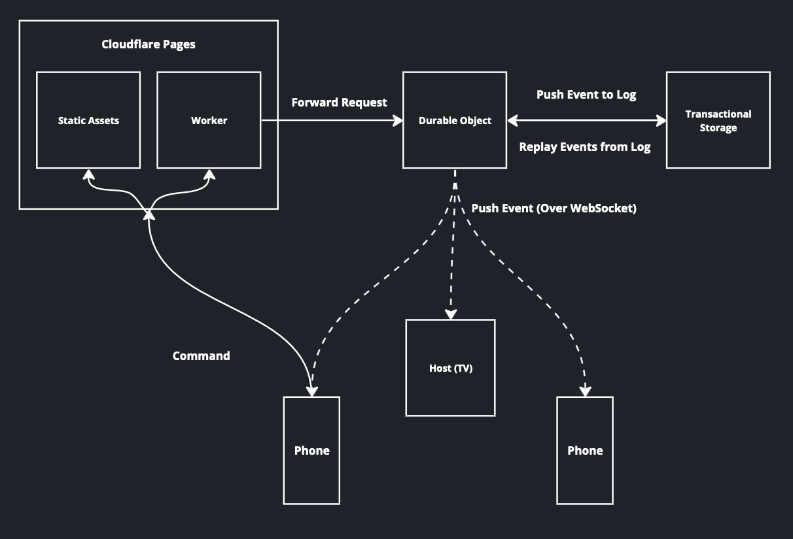

<!-- Leptos for frontend / server -->
<!-- Static assets avoid worker invocation -->

---

Behind the Scenes

---


---


---

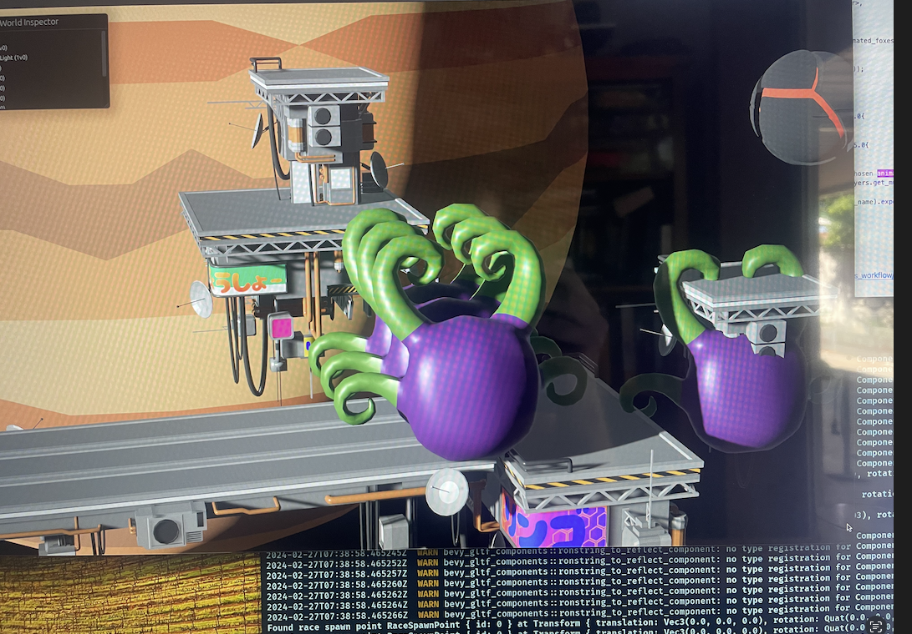

---

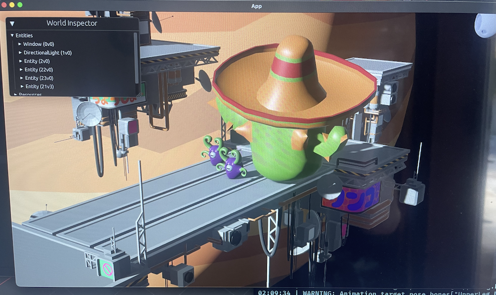

---

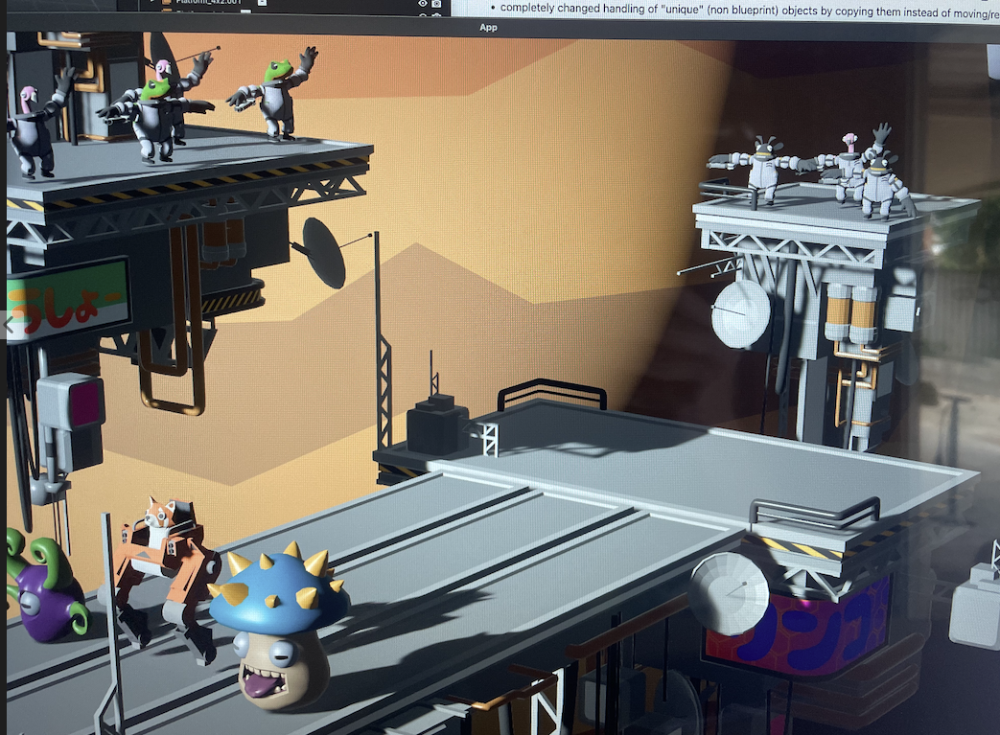

---

# Summary

<!--  Look outside AWS sometimes -->
<!--  Great UX for low latency -->
<!--  Actually scaling to zero -->

---

<style scoped>
  section {
    display: grid;
    grid-template-columns: 1fr 1fr;
  }

  h1 {
    grid-column: span 2;
  }
</style>

# Encore: WASM & WASI

WASI: A New Kind of System Interface by Lin Clark

What is a Component by Luke Wagner


<!-- Sidecar example -->
<!-- Supply chain attack mitigation -->
<!-- Sharing runtimes and libraries -->

---

<style scoped>
  p {
    font-size: 0.8em;
  }
</style>


https://discord.gg/zRdZjXbt